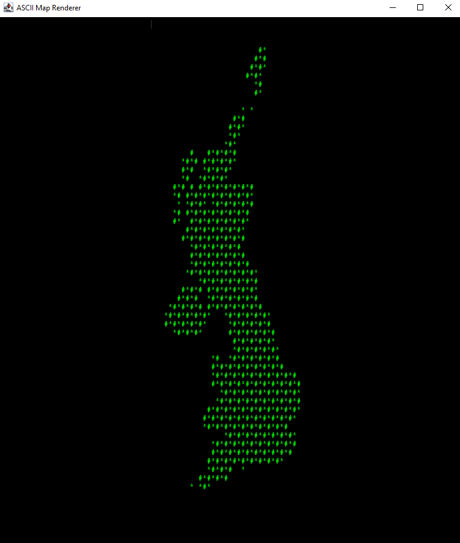

# ASCII MAP RENDERER

A utility java application that renders ASCII art maps by reading geographic coordinates from a CSV file.

### Sample Output (From UK Post Codes)


- Java 17 
- Gradle 7.2

The CSV format and default file which this tool was created for is provided by:  
https://github.com/dwyl/uk-postcodes-latitude-longitude-complete-csv/

If a jar is generated using this code, run with the following command:  
```
java -cp ascii-map-renderer-1.0.jar com.aobri.Main <csv-file-path.csv>
```
_Note: if an invalid path is provided, the program will search for "ukpostcodes.csv" within the same jar directory._     